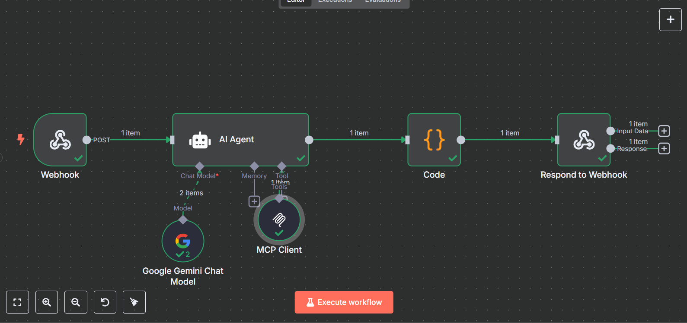
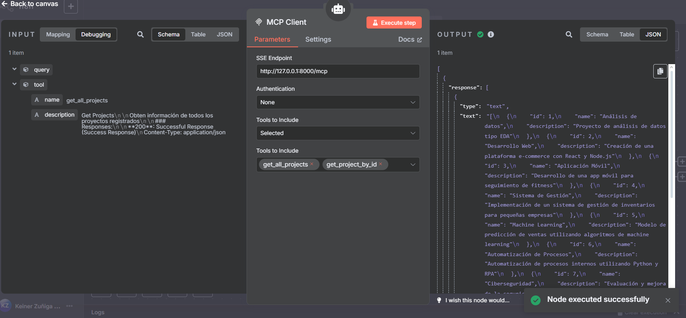
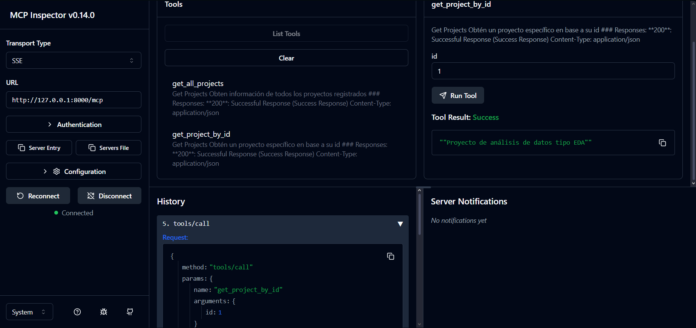
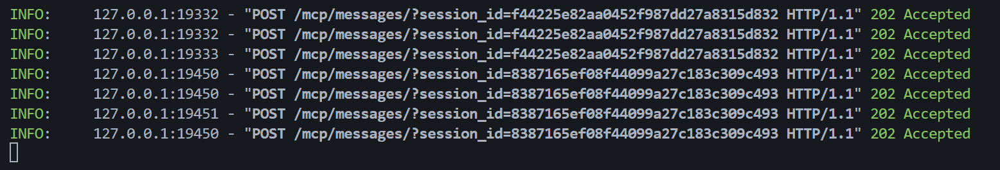
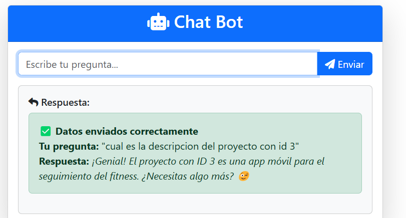
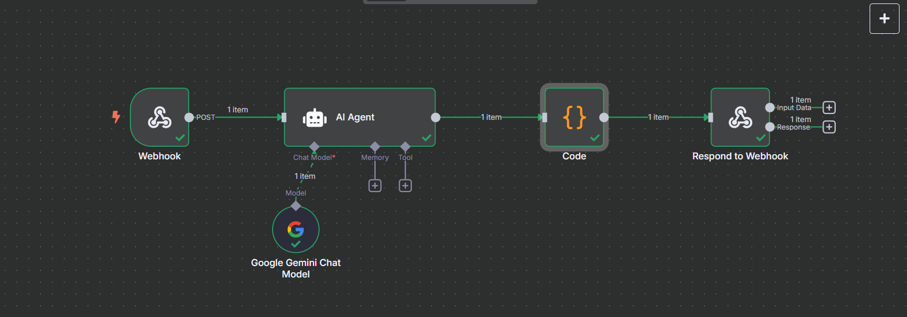
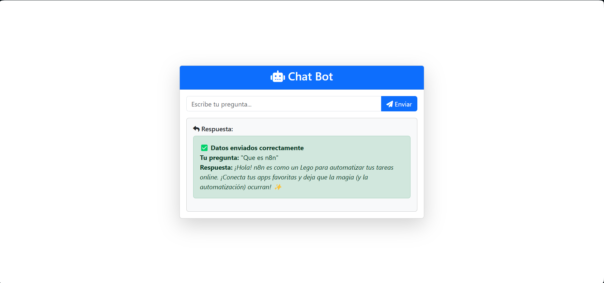

# 🤖 Integración N8N + FastAPI + MCP para Chatbot Web Avanzado

Este repositorio contiene la implementación completa de un chatbot inteligente que integra **N8N** como motor de procesamiento conversacional, **FastAPI** como servidor web y **MCP (Model Context Protocol)** para capacidades de IA avanzadas, todo renderizado en una interfaz moderna para la interacción del usuario.

## 🆕 **NUEVO: Integración con MCP (Model Context Protocol)**


*Workflow actualizado con nodo MCP para capacidades de IA avanzadas*


*Configuración de conexión MCP en el workflow*


*Inspector MCP mostrando las herramientas disponibles*


*Ejemplo de respuesta generada por el modelo MCP*


*Respuesta completa del modelo integrado con MCP*


*Actividad y ejecución del workflow con MCP*


*Workflow base de N8N configurado como chatbot*


*Formulario web responsive desarrollado con Bootstrap*

---

## 🏗️ Arquitectura del Sistema

```mermaid
graph TD
    %% Estilos
    classDef userStyle fill:#e1f5fe,stroke:#0288d1,stroke-width:2px,color:#000
    classDef frontendStyle fill:#f3e5f5,stroke:#7b1fa2,stroke-width:2px,color:#000
    classDef backendStyle fill:#e8f5e8,stroke:#2e7d32,stroke-width:2px,color:#000
    classDef mcpStyle fill:#fff3e0,stroke:#f57c00,stroke-width:2px,color:#000
    classDef n8nStyle fill:#fce4ec,stroke:#c2185b,stroke-width:2px,color:#000
    classDef aiStyle fill:#e3f2fd,stroke:#1976d2,stroke-width:2px,color:#000

    %% Nodos principales
    U[👤 Usuario<br/>Interfaz Web]:::userStyle
    F[🎨 Frontend<br/>HTML + Bootstrap + JS<br/>localhost:8080]:::frontendStyle
    B[⚡ Backend Principal<br/>FastAPI Server<br/>Puerto 8080<br/>Endpoints: /, /chatbot]:::backendStyle
    M[🔧 API MCP<br/>FastAPI Server<br/>Puerto 8000<br/>Endpoints: /get_all_projects, /get_project_by_id]:::mcpStyle
    N[🧠 N8N Workflow<br/>Motor de Chatbot<br/>Puerto 5678<br/>Webhook + MCP Node]:::n8nStyle
    A[🤖 MCP Server<br/>Model Context Protocol<br/>IA Avanzada + Herramientas]:::aiStyle

    %% Flujo principal
    U -->|1. Accede a interfaz| F
    U -->|2. Escribe pregunta| F
    F -->|3. HTTP POST /chatbot<br/>FormData: pregunta| B
    B -->|4. Webhook HTTP<br/>JSON: {pregunta}| N
    N -->|5. Procesa con MCP<br/>Contexto + Herramientas| A
    A -->|6. Respuesta IA<br/>Contextual + Métricas| N
    N -->|7. HTTP Response<br/>JSON: {Respuesta}| B
    B -->|8. JSON Response<br/>{status, Respuesta}| F
    F -->|9. Renderiza respuesta<br/>en tiempo real| U

    %% Conexiones adicionales MCP
    M -.->|APIs especializadas<br/>Base de datos| A
    A -.->|Herramientas disponibles<br/>Inspector MCP| N

    %% Información adicional
    subgraph "🔄 Flujo de Datos"
        direction LR
        D1[📝 Pregunta del Usuario]
        D2[🔄 Procesamiento N8N]
        D3[🧠 IA + MCP]
        D4[💬 Respuesta Inteligente]
        D1 --> D2 --> D3 --> D4
    end

    subgraph "🌐 Puertos y Servicios"
        direction TB
        P1[🌍 Puerto 8080<br/>Frontend + Backend Principal]
        P2[🔧 Puerto 8000<br/>API MCP + Documentación]
        P3[⚙️ Puerto 5678<br/>N8N Workflow Engine]
    end
```

### Componentes principales:

1. **🎨 Frontend (HTML + Bootstrap + JavaScript)**
   - Formulario interactivo para enviar preguntas
   - Interfaz responsive y moderna
   - Manejo de estados (cargando, éxito, error)

2. **⚡ Backend Principal (FastAPI - Puerto 8000)**
   - Servidor web que renderiza el formulario
   - Endpoint `/chatbot` que procesa las preguntas
   - Integración con N8N mediante HTTP requests

3. **🔧 API MCP (FastAPI - Puerto 8080)**
   - Servidor MCP independiente con endpoints especializados
   - Base de datos simulada con proyectos de ejemplo
   - Endpoints: `/get_all_projects`, `/get_project_by_id`
   - Montaje automático del servidor MCP en `/mcp`

4. **🧠 N8N (Motor del Chatbot)**
   - Workflow configurado como chatbot
   - Procesamiento de lenguaje natural
   - Lógica conversacional avanzada
   - **🆕 Integración con nodo MCP**

5. **🤖 MCP Server (Model Context Protocol)**
   - Servidor de protocolo de contexto de modelo
   - Capacidades de IA avanzadas
   - Integración con modelos de lenguaje
   - Herramientas y funciones especializadas

---

## 🔄 Flujo de Funcionamiento

### 1. **Inicialización del Usuario**
```
Usuario accede a: http://localhost:8080
```

### 2. **Renderizado del Formulario**
- FastAPI sirve la página HTML con el formulario
- El usuario ve una interfaz moderna con Bootstrap
- Campo de texto para escribir la pregunta

### 3. **Envío de Pregunta**
```javascript
// Frontend envía la pregunta
const formData = new FormData();
formData.append('pregunta', pregunta);

fetch('/chatbot', {
    method: 'POST', 
    body: formData
})
```

### 4. **Procesamiento en FastAPI**
```python
@app.post("/chatbot")
async def chatbot(pregunta: str = Form()):
    data = {"pregunta": pregunta}
    
    # Enviar a N8N
    async with httpx.AsyncClient() as client:
        response = await client.post(url=URL_N8N, json=data)
        
    # Procesar respuesta
    response_data = response.json()
    return {"Respuesta": response_data.get("Respuesta")}
```

### 5. **Procesamiento en N8N**
- N8N recibe la pregunta vía webhook
- Procesa el texto usando su motor conversacional
- Genera una respuesta inteligente
- Devuelve la respuesta a FastAPI

### 6. **🆕 Procesamiento con MCP (Model Context Protocol)**
- N8N activa el nodo MCP integrado
- MCP Server procesa la consulta con capacidades de IA avanzadas
- Se generan respuestas inteligentes y contextuales
- El modelo utiliza herramientas especializadas disponibles

### 7. **Respuesta al Usuario**
- FastAPI recibe la respuesta de N8N
- La envía de vuelta al frontend como JSON
- JavaScript renderiza la respuesta en tiempo real

---

## 🚀 Instalación y Configuración

### Prerrequisitos
- Python 3.8+
- N8N instalado y ejecutándose
- Node.js (para N8N)

### 1. **Clonar el repositorio**
```powershell
git clone <repository-url>
cd N8N
```

### 2. **Instalar dependencias de Python**
```powershell
pip install -r requirements.txt
```

### 3. **Configurar variables de entorno**
Crear archivo `.env`:
```env
N8N_URL=http://localhost:5678/webhook-test/request
```

### 4. **Importar workflow en N8N**
- Abrir N8N en `http://localhost:5678`
- Importar el archivo `Chat_bot_fastapi.json`
- Configurar el nodo MCP (ver sección MCP Setup)
- Activar el workflow

### 5. **Ejecutar la aplicación**

#### Opción 1: Ejecución dual (Recomendado)
```powershell
# Ejecutar ambos servidores simultáneamente
python run_servers.py
```
Esto iniciará:
- Servidor principal en `http://localhost:8080` (interfaz web)
- API MCP en `http://localhost:8000` (endpoints MCP)

#### Opción 2: Ejecución individual
```powershell
# Solo servidor principal
python -m uvicorn main:app --reload --host 0.0.0.0 --port 8080

# Solo API MCP (en otra terminal)
python -m uvicorn api_mcp:app --reload --host 0.0.0.0 --port 8000
```


### 6. **Acceder y verificar la aplicación**
- **Interfaz principal**: `http://localhost:8080`
- **API MCP**: `http://localhost:8000`
- **Documentación MCP**: `http://localhost:8000/docs`


## 📁 Estructura del Proyecto

```
N8N/
├── 📄 main.py                 # Servidor FastAPI principal (Puerto 8080)
├── 📄 api_mcp.py              # 🆕 API MCP para integración con IA (Puerto 8000)
├── 📄 db.py                   # Base de datos simulada con proyectos
├── 📄 requirements.txt        # Dependencias de Python
├── 📄 Chat_bot_fastapi.json   # Workflow de N8N con MCP
├── 📄 .env                    # Variables de entorno
├── 📄 Dockerfile              # Configuración Docker
├── 📄 run_servers.py          # Script de ejecución del servidor
├── 📁 templates/
│   └── 📄 index.html          # Interfaz web del chatbot
└── 📁 image/
    ├── 🖼️ nuevo_workflow.png   # 🆕 Workflow actualizado con MCP
    ├── 🖼️ Conexion_mcp.png     # 🆕 Configuración MCP
    ├── 🖼️ MCP_inspector.png    # 🆕 Inspector de herramientas MCP
    ├── 🖼️ Respuesta_mcp.png    # 🆕 Ejemplo respuesta MCP
    ├── 🖼️ Respuesta_modelo_con_mcp.png # 🆕 Respuesta completa
    ├── 🖼️ actividad_id3.png    # 🆕 Actividad del workflow
    ├── 🖼️ workflow.png         # Workflow base original
    └── 🖼️ interfaz.png         # Captura de la interfaz web
```

---

## 🔧 Endpoints de la API

### Servidor Principal (Puerto 8080)

#### `GET /`
- **Descripción**: Renderiza la página principal con el formulario
- **Respuesta**: HTML page

#### `POST /chatbot`
- **Descripción**: Procesa preguntas y las envía a N8N
- **Parámetros**: 
  - `pregunta` (form-data): Texto de la pregunta del usuario
- **Respuesta**:
```json
{
  "status": "Datos enviados correctamente",
  "n8n_status": 200,
  "pregunta": "¿Cómo estás?",
  "Resouesta": "¡Estoy muy bien, gracias por preguntar!"
}
```

### 🆕 **API MCP (Puerto 8000)**

#### `GET /get_all_projects`
- **Descripción**: Obtiene información de todos los proyectos registrados
- **Respuesta**:
```json
[
  {
    "id": 1,
    "name": "Análisis de datos",
    "description": "Proyecto de análisis de datos tipo EDA"
  },
  {
    "id": 2,
    "name": "Desarrollo Web", 
    "description": "Creación de una plataforma e-commerce con React y Node.js"
  }
]
```

#### `GET /get_project_by_id?id={id}`
- **Descripción**: Obtiene un proyecto específico por su ID
- **Parámetros**: 
  - `id` (query): ID del proyecto (entero)
- **Respuesta**:
```json
"Proyecto de análisis de datos tipo EDA"
```

#### `GET /mcp`
- **Descripción**: Endpoint montado automáticamente del servidor MCP
- **Documentación**: Disponible en `/docs` para explorar capacidades MCP

---

## 🤖 **NUEVO: Configuración MCP (Model Context Protocol)**

### ¿Qué es MCP?
MCP (Model Context Protocol) es un protocolo estándar que permite a las aplicaciones integrar capacidades de IA avanzadas de manera estructurada y escalable. En este proyecto, MCP actúa como puente entre N8N y modelos de lenguaje avanzados.

### Características del Nodo MCP:
- **🧠 Integración con LLMs**: Conexión directa con modelos de lenguaje
- **🔧 Herramientas especializadas**: Acceso a funciones y APIs específicas
- **📊 Inspector de herramientas**: Visualización de capacidades disponibles
- **⚡ Respuestas contextuales**: Procesamiento inteligente de consultas

### Configuración del Nodo MCP en N8N:

1. **Agregar nodo MCP al workflow**
   - Buscar "MCP" en la paleta de nodos
   - Conectar después del webhook de entrada

2. **Configurar conexión MCP**
   ```json
   {
     "server_url": "http://localhost:8000/mcp",
     "model": "tu_llm",
     "max_tokens": 2000,
     "temperature": 0.7
   }
   ```

3. **Verificar herramientas disponibles**
   - Usar el MCP Inspector para ver funciones disponibles
   - Configurar permisos y accesos según necesidades

### 🗄️ **Base de Datos MCP**
El servidor MCP incluye una base de datos simulada con 10 proyectos de ejemplo que cubren diferentes áreas tecnológicas:
- Análisis de datos y Machine Learning
- Desarrollo Web y Móvil
- Ciberseguridad y Blockchain
- IoT y Realidad Virtual
- Automatización de procesos

### 📊 **Ejemplos de Consultas MCP**
```bash
# Obtener todos los proyectos
curl http://localhost:8000/get_all_projects

# Obtener proyecto específico
curl "http://localhost:8000/get_project_by_id?id=1"

# Explorar documentación interactiva
# Visitar: http://localhost:8000/docs
```

### Ejemplo de respuesta MCP:
```json
{
  "response": "Basándome en tu consulta, he analizado el contexto y puedo proporcionarte una respuesta detallada...",
  "tools_used": ["web_search", "knowledge_base"],
  "confidence": 0.95,
  "processing_time": "1.2s"
}
```

---

## 🎯 Características

### ✅ **Frontend**
- 🎨 Interfaz moderna con Bootstrap 5
- 📱 Diseño responsive (móvil y desktop)
- ⚡ Indicadores de estado en tiempo real
- 🔄 Manejo de errores y timeouts
- 🎭 Iconos de Font Awesome

### ✅ **Backend**
- ⚡ FastAPI con alta performance
- 🔒 Validación de datos con Pydantic
- 🌐 Integración HTTP con N8N
- 📝 Manejo de errores robusto
- 🔄 Soporte para formularios web

### ✅ **N8N Integration**
- 🤖 Chatbot inteligente
- 📡 Comunicación vía webhooks
- 🔄 Procesamiento asíncrono
- 📊 Workflow visual y configurable

### ✅ **🆕 MCP Integration**
- 🧠 **Modelo de IA avanzado**: Integración con LLMs de última generación
- 🔧 **Herramientas especializadas**: Acceso a funciones y APIs específicas
- 📊 **Inspector de capacidades**: Visualización completa de herramientas disponibles
- ⚡ **Respuestas contextuales**: Procesamiento inteligente con memoria de contexto
- 🔄 **Procesamiento distribuido**: Escalabilidad y performance optimizada
- 📈 **Métricas de confianza**: Evaluación de calidad de respuestas
- 🛠️ **Configuración flexible**: Adaptable a diferentes modelos y necesidades

---
